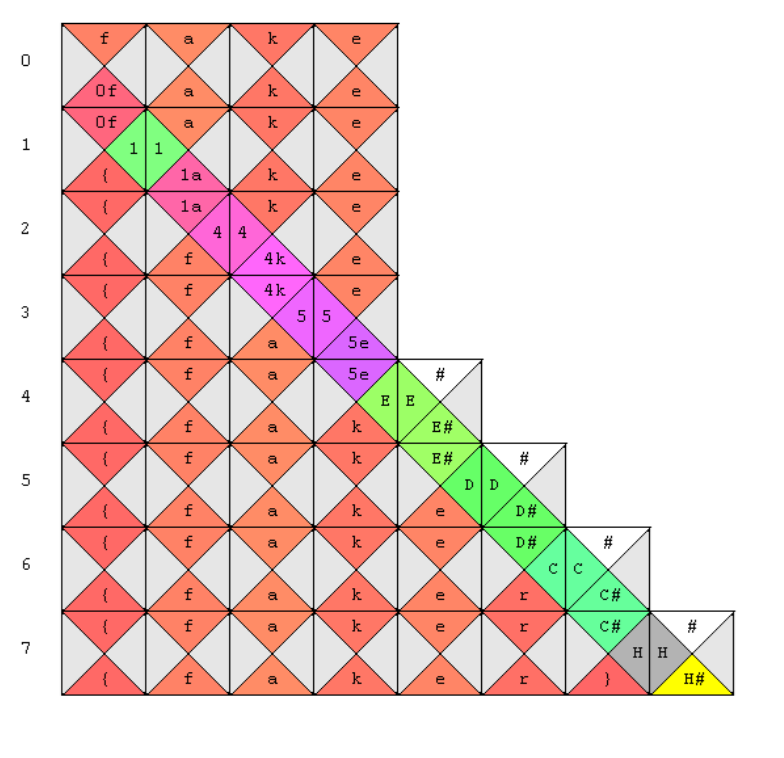
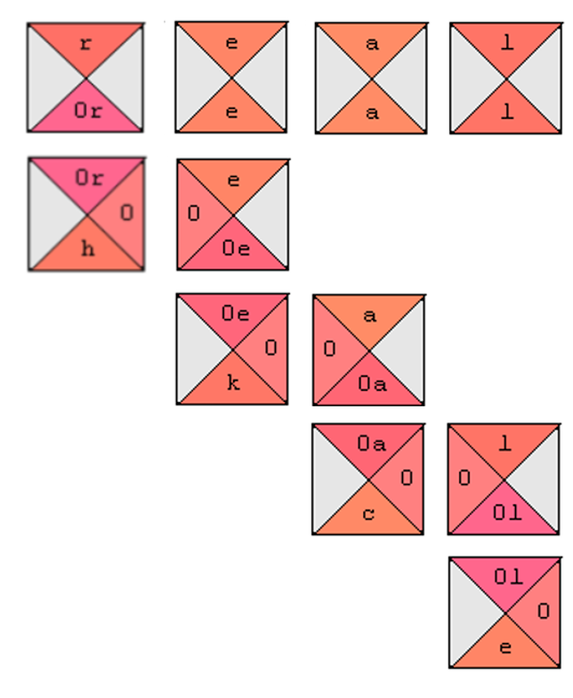
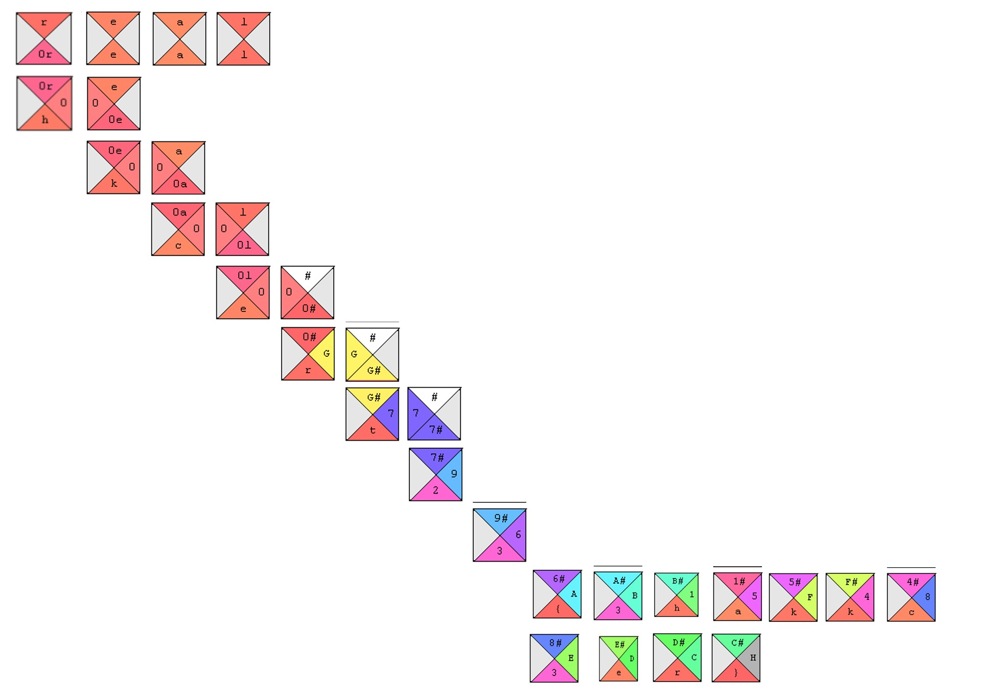

# Wang123

Wang123 是一個拼圖題目。

從 fake flag 的構造中，並參考[王氏磚](https://zh.wikipedia.org/zh-hk/%E7%8E%8B%E6%B0%8F%E7%A3%9A)的有關知識，我們可以發現，flag 的構造由 fake 四個塊開始，依次向下和向右填充區塊。

每個區塊的要求是：

上面的部分和上面區塊的下面部分相同，左面的部分和左面區塊的右面部分相同。

如果沒有上面的區塊，假定上面區塊的下面部分為 `#`。

現在我們閲讀題面：

`fake flag is faker than real flag, so what is the real flag?`

可以推斷出 real flag 產生自 real。

現在我們開始拼圖。

考慮到上面部分為 `#` 的區塊的特殊性，我們將簡化一些拼圖步驟：

得到 flag `hkcert23{3hackkc3er}`。